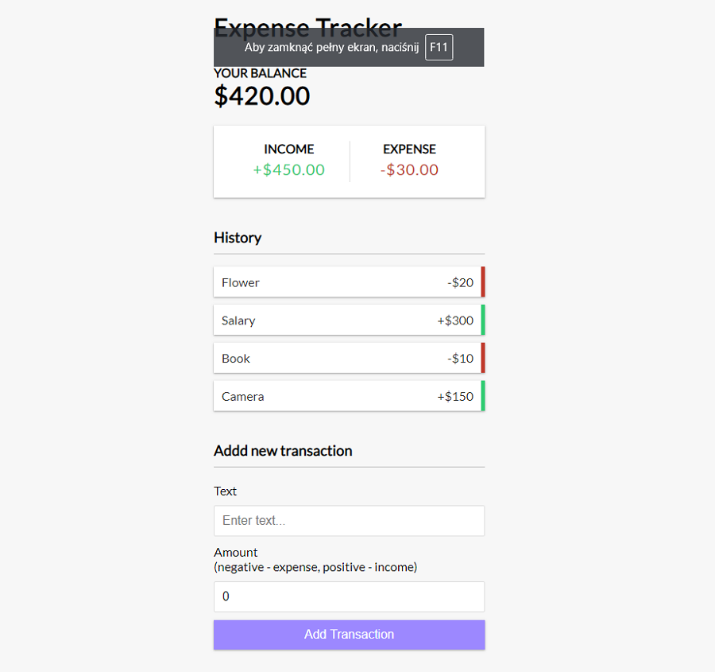

# Expense-Tracker in React

Expense-Tracker is a create react app. It was created for desktop views only. App is monitoring
income and expenses of budget.

## Tools & Technology used

- Visual Studio Code
- React
- Create-React-App
- ContextAPI
- useState, useEffect, useReducer
